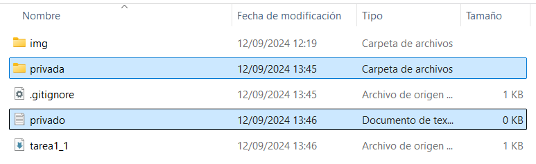
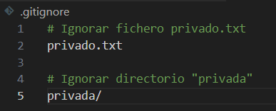

# Tarea 1.1 - GitHub y Markdown

<div align=center>
    
</div>

<div align=justify>

A continuación se muestra de forma resumida el progreso de la tarea propuesta para la asignatura de DPL:

## Contenidos

- [Comandos utilizados](#comandos-utilizados)
- [Uso del .gitignore](#uso-del-gitignore)
- [Tabla de perfiles de compañeros](#tabla-con-perfiles-de-compañeros)

## Comandos utilizados

1. Clonado del repositorio remoto
```git
git clone https://github.com/JesusLugo2002/DPL_A_Jesus.
```

2. Commit inicial:
```
git add .
git commit -m "Commit inicial"
git push
```

3. Creación de tag:
```
git tag v0.1
```

## Uso del .gitignore

<div align=center>
    <h3>Directorio con los archivos por ocultar</h3>
    
    <h3>Contenido del fichero .gitignore</h3>
    
</div>

## Tabla con perfiles de compañeros

|Nombre|GitHub|
|------|------|
|German Adolfo|[GermanOjeda](https://github.com/GermanOjeda)|
|Rashi Chugani|[Rashi](https://github.com/Chugani05)|
|Kai Rodriguez|[YoooKai](https://github.com/YoooKai)|

</div>