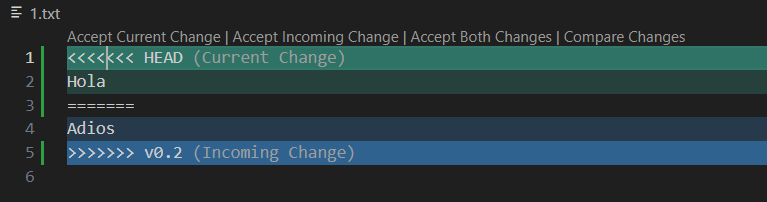
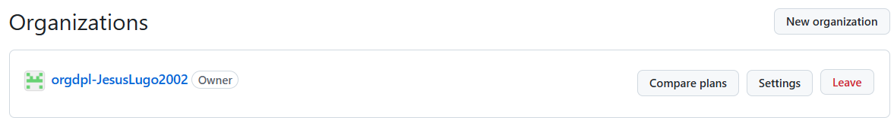

# Tarea 1.1 - GitHub y Markdown

<div align=center>
    
</div>

<div align=justify>

A continuación se muestra de forma resumida el progreso de la tarea propuesta para la asignatura de DPL:

## Contenidos

- [Comandos utilizados](#comandos-utilizados)
- [Uso del .gitignore](#uso-del-gitignore)
- [Tabla de perfiles de compañeros](#tabla-con-perfiles-de-compañeros)

## Comandos utilizados

1. Clonado del repositorio remoto
```git
git clone https://github.com/JesusLugo2002/DPL_A_Jesus.
```

2. Commit inicial:
```
git add .
git commit -m "Commit inicial"
git push
```

3. Creación de tag:
```
git tag v0.1
```

4. Creación y uso de una rama nueva:
```
git branch v0.2
git checkout v0.2
```

5. Creación de la rama remota:
```
git push origin v0.2
```

6. Merge directo:
```
git checkout main
git merge v0.2
```

7. Merge con conflicto:
<div align=center>
    
</div>
```
git checkout main
git merge v0.2
git commit -m "Se soluciona conflicto aceptando cambios de la rama v0.2"
```

8. Listar ramas sin merge y con merge:
```
git branch
git branch --merged
```
__Resultado de ambas listas__:
```
* main
  v0.2
```

9. Reemplazar rama v0.2 por un tag v0.2:
```
git tag v0.2
git branch -d v0.2
```

10. Listar commits con tags y ramas:
```
git log --decorate --pretty=oneline

956b23ee610d1c974469b115704113e2c8e79bbf (HEAD -> main) Se borra rama y se crea tag con el mismo nombre
a73ea0d53cef8eb1520728df9b15b2d0c1941758 (tag: v0.2) Se soluciona conflicto aceptando cambios de la rama v0.2
22ee403a5e49db81dee6ce5b990d5a5460ffd05e Se añade 'adios' a 1.txt
1633be3244d38a1a4ad153b3ce4b1158aec6f047 Se añade 'hola' a 1.txt
9a2468279493cd1303be7e97b883ed78d04ea8e0 (origin/v0.2) Se arregla conflicto con el markdown
bb6170a21997dde9101753178a79dfd8ec1da99f Se añade 2.txt en la nueva rama
f1da79575ec1ca6c20960d3febeb78689acd5e07 (origin/main) Se añade tabla de perfiles
aa21448773677a5f8dc30300008be4b344d276a3 Subida de tag y cambios aplicados
f088c0576934e40a4fcdb1c831afc1660cfa0e00 (tag: v0.1) Commit inicial
```

## Uso del .gitignore

<div align=center>
    <h3>Directorio con los archivos por ocultar</h3>
    
    <h3>Contenido del fichero .gitignore</h3>
    
</div>

## Tabla con perfiles de compañeros

|Nombre|GitHub|
|------|------|
|German Adolfo|[GermanOjeda](https://github.com/GermanOjeda)|
|Rashi Chugani|[Rashi](https://github.com/Chugani05)|
|Kai Rodriguez|[YoooKai](https://github.com/YoooKai)|

## Creación de la organización

Se puede acceder a la organización mediante el [siguiente enlace](https://github.com/orgdpl-JesusLugo2002).

<div align=center>
    
</div>


</div>